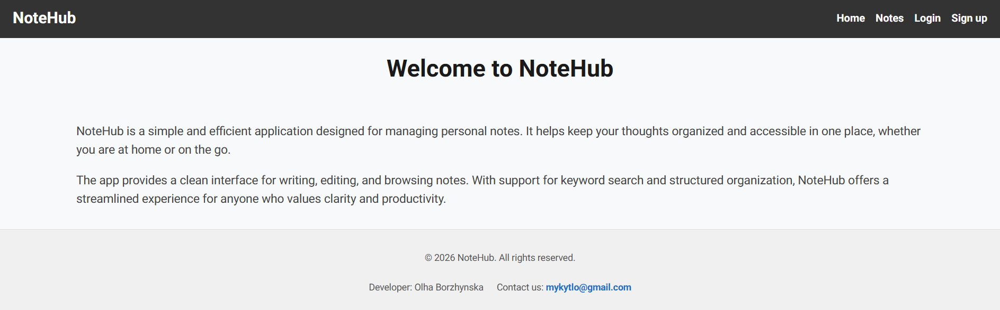

# 📝 NoteHub — A Space for Your Ideas

<p align="center">
  
</p>

---

## 🎯 About the Project

📄 **Live Page:** [View Project](https://09-auth-three-snowy.vercel.app/)

**NoteHub** — is a modern web application for creating, viewing, and managing personal notes. The project was developed using Next.js and TypeScript and demonstrates working with user authentication, protected routes, global state management, and REST API integration.

---

## 🚀 Features

- User registration and authentication
- Automatic session refresh
- Protected pages for authenticated users
- Creating new notes
- Viewing a list of notes
- Searching notes by keywords
- Pagination for convenient navigation between records
- Viewing detailed note information
- Editing user profile
- Uploading and updating an avatar
- Form validation and error handling
- Responsive interface for different devices 

---

## 🛠 Technologies Used

[](https://skillicons.dev)

| Technologies and Libraries Used     | 
| :---------------------------------------- | 
| **Next.js** | 
| **React** | 
| **TypeScript**  | 
| **CSS Modules**  |
| **Zustand** | 
| **React Query (TanStack Query)** | 
| **Axios**     |
| **REST API**     |
| **JWT** | 
| **Cookies** | 
| **Middleware for route protection** |

---

## 📂 Features Overview

- **Authentication:** Users can create an account, log in, and securely work with their data. JWT tokens and cookies are used to maintain the user session.
- **Note Management:** After logging in, users have access to their personal notes and can create new notes, view existing ones, search notes, and navigate through result pages.
- **User Profile:** Users can edit their personal information and change their avatar.

---

## 📚 Skills Acquired

During the development of the project, I gained practical experience in:

- Working with the App Router in Next.js
- Implementing authentication and authorization
- Protecting private routes using Middleware
- Managing global state with Zustand
- Working with server-side and client-side rendering
- Integrating REST API using Axios
- Caching and synchronizing data using React Query
- TypeScript application type safety

## 🎯 Project Goal 

To create a full-featured note management application with a modern architecture, secure authentication system, and convenient user interface using up-to-date tools from the React and Next.js ecosystem.

---

## ⚙️ How to Run the Project Locally

**Clone the repository:**

```bash
git clone https://github.com/OlhaBorzhynska/09-auth.git
```

**Install dependencies:**

```bash
npm install
```

**Run the development mode:**

```bash
npm run dev
```
